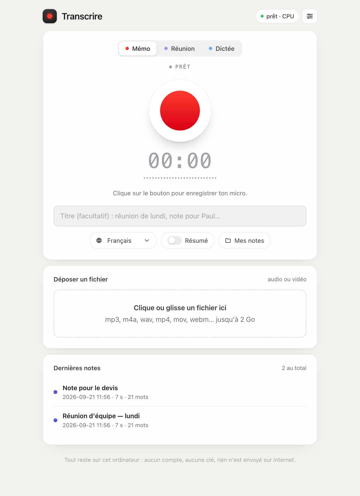

# Transcrire

Enregistre une réunion, un mémo ou une dictée, et récupère le texte écrit, sur ton PC Windows, gratuitement, sans compte ni abonnement.



Rien n'est envoyé sur internet : la reconnaissance vocale tourne sur ta machine. Tu peux couper le wifi et continuer à t'en servir.

## Ce que ça fait

| Mode | À quoi ça sert |
|---|---|
| **Mémo** | Ton micro. Une idée, une note de fin de journée, un compte rendu dicté. |
| **Réunion** | Ton micro **plus le son de l'ordinateur** : Teams, Meet, Zoom, une vidéo. Les deux voix sont mélangées dans le même enregistrement. |
| **Dictée** | Tu parles, tu arrêtes, le texte arrive dans le presse-papiers. Tu le colles où tu veux. |
| **Déposer un fichier** | Un mp3, un m4a, un mp4, une vidéo de 2 heures : glisse-le dans la fenêtre. |

Chaque enregistrement produit une note Markdown datée, plus les sous-titres `.srt`, rangés dans `Documents\Transcrire`.

## Installation

1. Clique sur **Code** puis **Download ZIP**, en haut de cette page. (Ou prends le ZIP dans [Releases](../../releases).)
2. Décompresse le dossier où tu veux, par exemple dans `Documents`.
3. Double-clique sur **`installer.bat`**. Il pose Python s'il manque, puis les composants, puis un raccourci sur le Bureau.
4. Double-clique sur **Transcrire** (Bureau). Une fenêtre noire s'ouvre et l'interface apparaît dans ton navigateur.

La première installation télécharge environ 500 Mo et prend cinq à dix minutes. Ensuite, tout est local.

Au premier enregistrement, le navigateur demande l'accès au micro : accepte.

### Pour les développeurs

```bash
python -m venv .venv
.venv\Scripts\pip install -r requirements.txt
.venv\Scripts\python -m transcrire            # ouvre http://127.0.0.1:7791
```

Options : `--port 7791`, `--modele small`, `--dossier "D:\Notes"`, `--sans-navigateur`.

## Enregistrer une réunion Teams, Meet ou Zoom

C'est le seul point qui demande un geste de ta part, une seule fois par enregistrement :

1. Choisis **Réunion**, clique sur le bouton rouge.
2. Windows demande quoi partager. Choisis **l'onglet** de la visio, ou **l'écran entier**.
3. **Coche la case « Partager l'audio »** en bas de cette fenêtre. Sans elle, tu n'auras que ta propre voix.

Le partage sert uniquement à capter le son : l'image n'est ni enregistrée ni envoyée nulle part.

> Préviens les personnes présentes que tu enregistres. En France, enregistrer une conversation professionnelle à l'insu des participants n'est pas légal.

## Où sont mes notes

```
Documents\Transcrire\
  index.md                        la liste de tout, du plus récent au plus ancien
  2026-09-21\
    2026-09-21_14h05_point-budget.md    le texte, avec son en-tête
    2026-09-21_14h05_point-budget.srt   les sous-titres, minutés
```

Le bouton **Mes notes** ouvre directement ce dossier. Tu peux le changer dans les réglages.

Une note de moins de cinq mots n'est jamais écrite : c'est un faux départ ou du silence, et ça évite de polluer le dossier.

## Résumé automatique, facultatif et gratuit

Si tu installes [Ollama](https://ollama.com/download) et un modèle (`ollama pull llama3.2`), l'interrupteur **Résumé** s'active. Chaque note commence alors par les décisions, les tâches et les sujets abordés, écrits par un modèle qui tourne lui aussi sur ta machine.

Sans Ollama, l'application fonctionne exactement pareil, sans la section résumé.

## Qualité ou vitesse

Dans les réglages, cinq niveaux. Les durées sont mesurées sur un PC de bureau sans carte graphique dédiée, pour une heure d'audio :

| Réglage | Modèle | Poids | Une heure d'audio |
|---|---|---|---|
| Très rapide | tiny | 75 Mo | environ 4 minutes |
| Rapide | base | 145 Mo | environ 7 minutes |
| Équilibré (par défaut) | small | 480 Mo | environ 20 minutes |
| Précis | medium | 1,5 Go | environ 50 minutes |
| Maximum | large-v3 | 3 Go | plus d'une heure |

Avec une carte NVIDIA, c'est cinq à dix fois plus rapide et le réglage « Précis » devient confortable. L'application la détecte toute seule (la pastille en haut à droite affiche `CUDA` au lieu de `CPU`).

Pour une réunion à plusieurs voix, « Équilibré » est le bon compromis. Pour un mémo dicté au calme, « Rapide » suffit.

## Vie privée

- Aucune clé d'API, aucun compte, aucun envoi : la transcription se fait sur ton ordinateur.
- Le serveur n'écoute que sur `127.0.0.1` et refuse toute requête sans le jeton tiré au démarrage : une page web ouverte à côté ne peut pas piloter ton micro.
- Les enregistrements bruts restent dans `%APPDATA%\Transcrire\enregistrements`.
- Vérifie ton micro avant une pause : il capte tout ce qui se dit tant que le chrono tourne.

## Si ça coince

**« Le micro est refusé »** : clique sur l'icône de cadenas dans la barre d'adresse du navigateur, autorise le micro, recharge la page.

**« Je n'entends que moi dans la réunion »** : la case « Partager l'audio » n'était pas cochée. Recommence, elle est en bas à gauche de la fenêtre de partage. Sur Firefox, le partage du son système n'existe pas : utilise Chrome ou Edge.

**« C'est lent »** : passe en « Rapide » dans les réglages. Une heure d'audio reste une heure d'audio : laisse la fenêtre ouverte, le traitement continue.

**« La fenêtre noire s'est fermée toute seule »** : relance `installer.bat`, il répare l'environnement.

**« L'antivirus râle »** : le fichier `.bat` ne fait que lancer Python. Tu peux lire son contenu avec le Bloc-notes, il fait dix lignes.

## Sous le capot

Python et [faster-whisper](https://github.com/SYSTRAN/faster-whisper) (le modèle Whisper d'OpenAI, réimplémenté pour tourner vite sur processeur). L'interface est une page web servie en local : c'est le navigateur qui enregistre, Python qui transcrit. Aucun ffmpeg à installer, le décodage audio est embarqué.

Le test d'intégration (`tests/test_bout_en_bout.py`) dépose un vrai fichier audio dans la vraie pile et vérifie la note produite. Il tourne sur Windows à chaque modification, voir l'onglet Actions.

## Ce qui n'est pas là

Cette version est le portage Windows d'une application macOS native. Ce qui dépendait du système Apple n'a pas été repris : les raccourcis clavier actifs partout (ici `Ctrl+M` ne marche que dans la fenêtre), la détection automatique d'une visio en cours, le déclenchement à la voix, l'icône dans la barre des menus, la création de rappels.

## Licence

MIT. Fais-en ce que tu veux.
